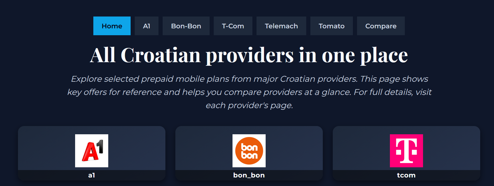
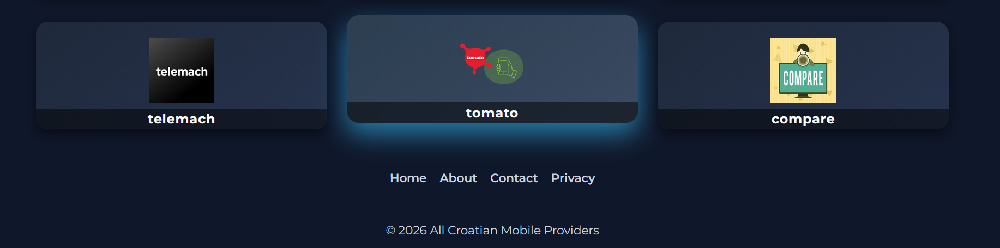
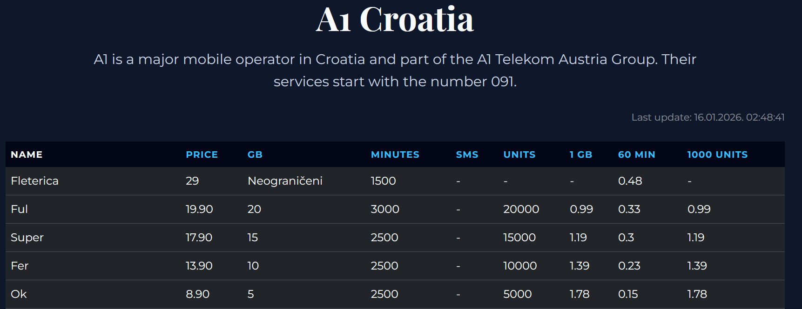
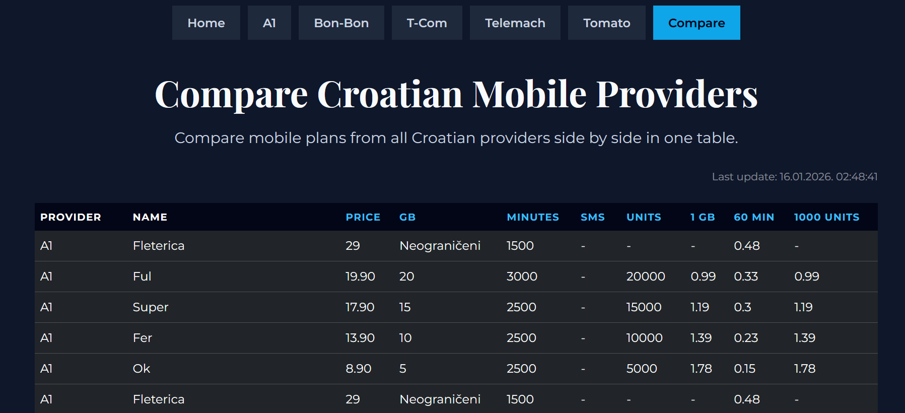
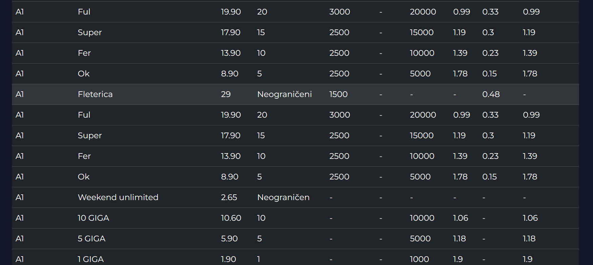
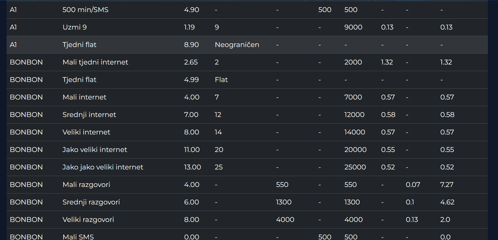
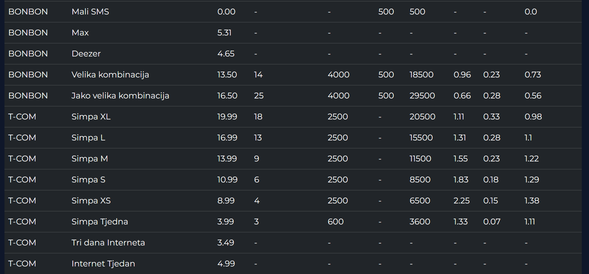
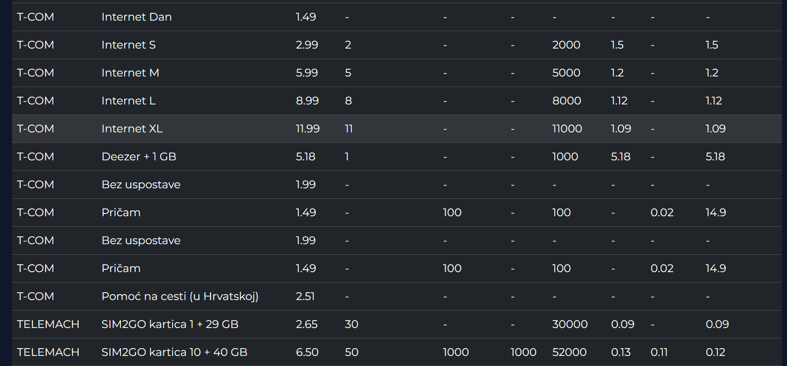
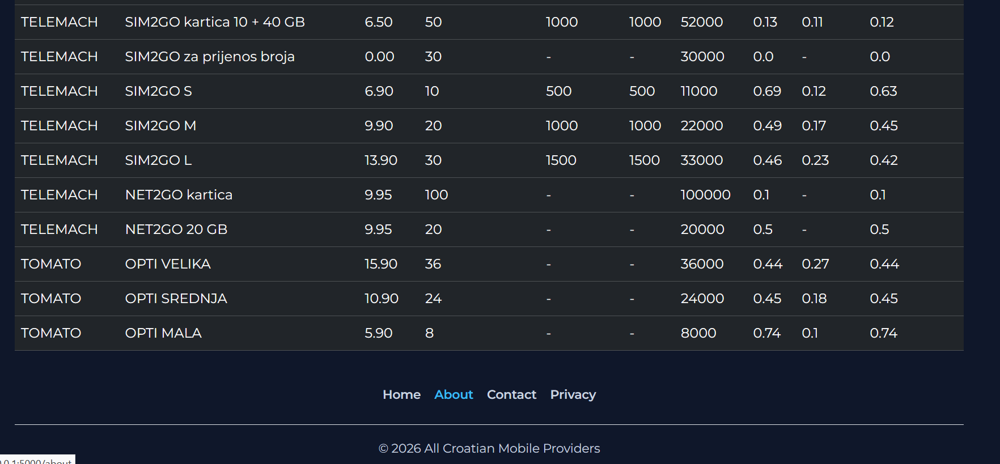
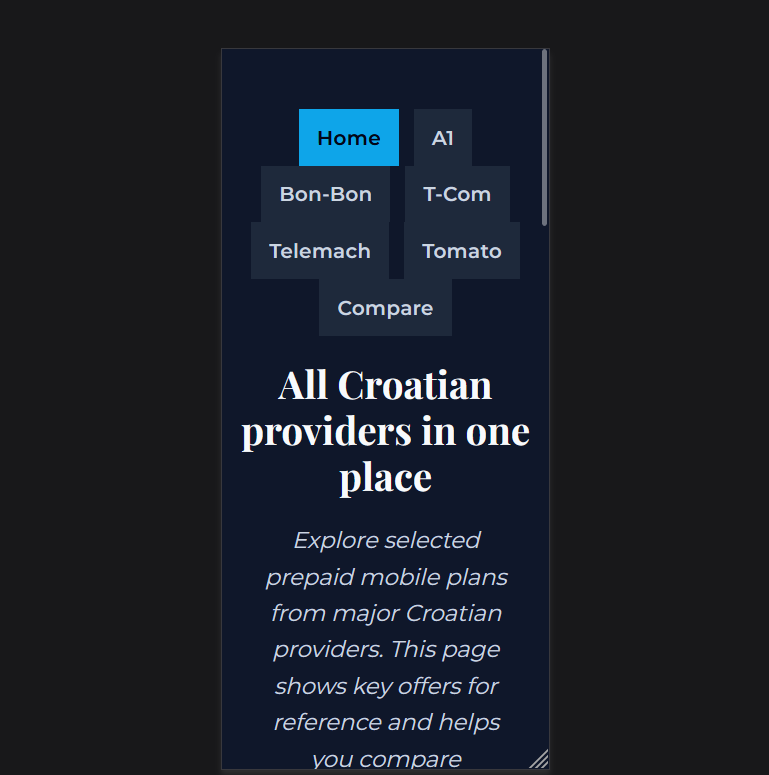

# Prepaid Price Comparison (Croatia)

A backend-focused portfolio project that scrapes, normalizes, and displays mobile prepaid plans from five Croatian providers:  
**A1, Bon-Bon, T-Com, Telemach, Tomato**

This project demonstrates real-world backend engineering concepts: data pipelines, automation, validation, modular architecture, and production-style project structure using Python.

---

## Features
- Automated scraping of live operator data with Playwright  
- Normalized database schema using SQLAlchemy  
- Structured logging via Loguru  
- Modular scraping workflows per provider  
- Read-only Flask dashboard for consistent plan comparison  
- Data validation and error handling  
- Test coverage using pytest  
- Clear, modular architecture following real-world backend patterns  

---

## Tech Stack
- Python 3.10+  
- Flask – read-only dashboard  
- SQLAlchemy – database ORM  
- PostgreSQL – database  
- Playwright – web scraping  
- Loguru – structured logging  

---

## Project Architecture
```bash
price_comparison/
├─ config/             # Provider and environment settings
├─ db/                 # Database access, tables, insert scripts
├─ logs/               # Logs of scraping and processing
├─ scripts/            # Main runner and provider scrapers
├─ tariff_selectors/   # CSS selectors for scraping each provider
├─ templates/          # HTML templates
├─ validation/         # Data validation rules
├─ workflows/          # Scraper workflows
├─ tests/              # Unit tests
├─ .env                # Environment variables (not committed)
├─ README.md
└─ INSTRUCTIONS.txt
```

---

## Quick Start (Local)

### 1. Clone the repository
```bash
git clone <repo-url>
cd price_comparison
```
### 2. Create and activate a virtual environment

### Windows
```bash
python -m venv venv
venv\Scripts\activate
```

### Linux / Mac
```bash
python -m venv venv
source venv/bin/activate
```

### 3. Install dependencies
```bash
pip install -r requirements.txt
pip install -r requirements-dev.txt   # optional, for testing
```

### 4. Set up PostgreSQL
- Create a database
- Add credentials to the .env file


### 5. Run the scraper
```bash
python price_comparison/scripts/main_runner.py a1 bon com telemach tomato
```
### After running:
- Data is inserted into the database
- lastupdate.txt records the last successful run
- Logs are stored in logs/

### 6. Run Flask dashboard

Linux / Mac
```bash
export FLASK_APP=price_comparison.main
flask run
```
Windows
```bash
set FLASK_APP=price_comparison.main
flask run
```
Open your browser at: http://127.0.0.1:5000/

---

###  Data Validation Rules
- Required fields: provider, name, price, gb, minutes, sms, music, video, units, one_gb_price, sixty_min_price, a thousand_units
- Allowed providers: A1, BONBON, T-COM, TELEMACH, TOMATO
- GB values: numeric ≤ 500 or strings like Neograničeni, Unlimited, Flat
- Price fields: numeric strings between 0 and 200
- Optional fields: minutes, sms, music, video may be empty
- If validation fails, data for that provider is not inserted and an error is logged.

### Running Tests
```bash
pytest
```

---

### Security & Safety
- No public write endpoints
- All secrets stored in .env (never committed)
- Scrapers are read-only
- No destructive operations
- Safe for portfolio deployment

---

### Purpose
This project is designed for portfolio demonstration, showing:
- Backend architecture
- Workflow pipelines
- Automation
- Data validation
- System thinking
- Production-style structure

Not intended as a commercial product.

---

### Notes for Recruiters / Reviewers
- Modular structure separates providers, workflows, validation, and database layers
- Logging and error handling demonstrate production awareness
- Front-end is minimal, read-only, and functional
- Focus is on backend engineering principles
- Designed as a clean, inspectable backend system

---

## Screenshots

### Home Page



### A1 Page


### Compare Page







### Mobile View

